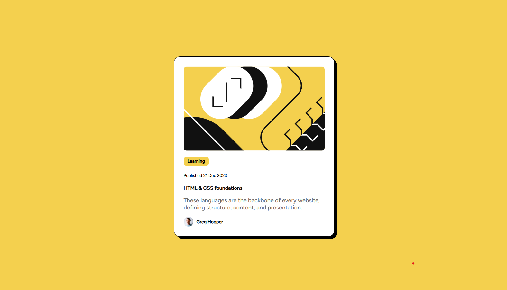
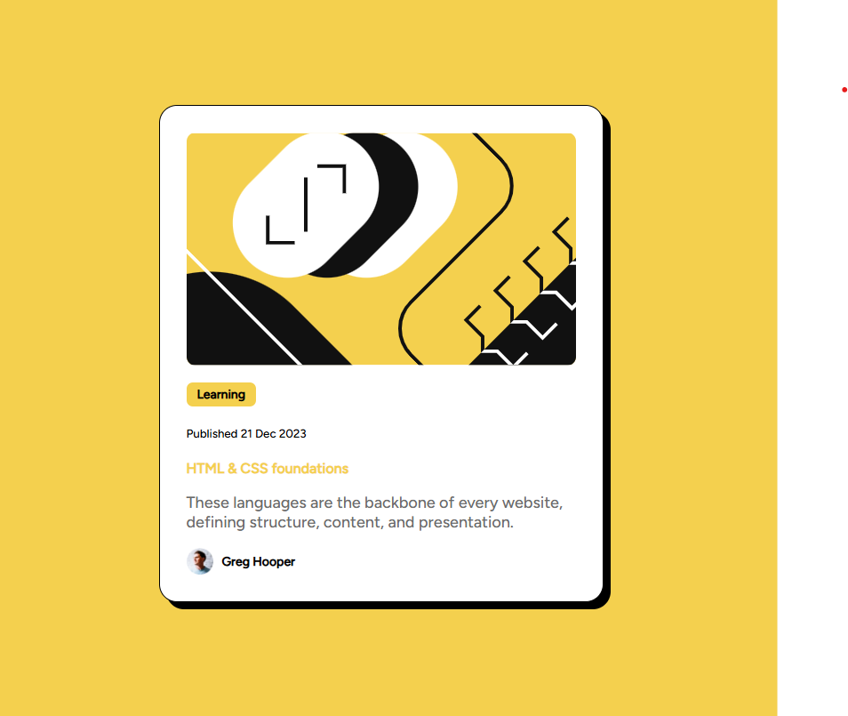

📌 Blog Preview Card

🚀 A simple blog preview card challenge from [Frontend Mentor](https://www.frontendmentor.io/challenges/blog-preview-card-ckPaj01IcS).  

📷 Screenshot 
1. Desktop View

2. Mobile View

3. onHover

📁 Project Setup
1. Clone the repo:  

   git clone https://github.com/rushika1503/blogPreviewCard_FM.git
   cd blog-preview-card
   
2. Open index.html in a browser.  

🎨 Technologies Used
- HTML  
- CSS  
- Flexbox  

👨‍💻 Live Demo 
🔗[View Live](https://rushika1503.github.io/blogPreviewCard_FM/)

